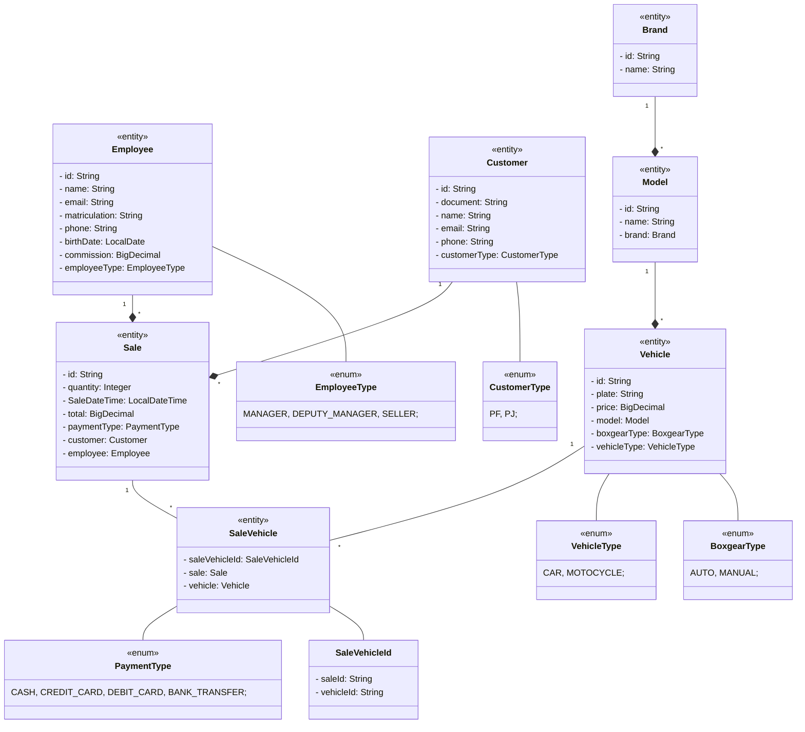

# Automendes 

## Sobre

Sistema da concessionária Auto Mendes.

## Modelo



# Recursos Do Projeto

## Backend

- Hibernate/JPA.
- H2DB.
- PostGreeSQL.
- Lombok.
- OpenAPI/Swagger.
- SOLID.
- MVC.
- Spring Boot.
- Java 17.

# Funcionalidades 

## Funcionários 

- Registra funcionário.
- Atualiza funcionário.
- Lista funcionários.

## Veículos

- Registra veículo.
- Atualiza veículo.
- Lista veículo pelo modelo.

## Marca

- Registra marca.
- Atualiza marca.
- Lista marca pelo nome.

## Modelo

- Registra modelo.
- Atualiza modelo.
- Lista modelo pelo nome.

## Cliente

- Registra cliente.
- Atualizar cliente.
- Procurar cliente pelo documento.

# Requisições 

## Registra funcionário.

```json
/api/employees/register-employee

{
  "name": "",
  "email": "",
  "matriculation": "",
  "phone": "",
  "birthDate": "2025-08-19",
  "employeeType": "MANAGER",
  "commission": 0
}
```

## Atualiza funcionário.

```json
/api/employees/register-employee

{
  "name": "",
  "email": "",
  "matriculation": "",
  "phone": "",
  "birthDate": "2025-08-19",
  "employeeType": "MANAGER",
  "commission": 0
}
```

## Lista funcionários.


# Execução Do Projeto

- Copie e execute repositório em uma IDE.
- Acesse [a docmentação da API](http://localhost:8080/swagger-ui/index.html) ou use outra plataforma para testa a API.

```bash
# clone repository
git clone https://github.com/abnerjosefelixbarbosa/auto-mendes-back-end-java.git
```

# Autor

Abner José Felix Barbosa.

[](https://www.linkedin.com/in/abner-jose-feliz-barbosa/)
