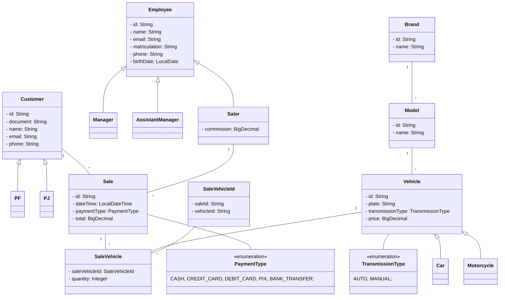

# auto-mendes 

## Sobre

Sistema da concessionária Auto Mendes.

## Modelo



# Recursos Do Projeto

## Backend

- Hibernate/JPA.
- H2DB.
- PostGreeSQL.
- Lombok.
- OpenAPI/Swagger.
- SOLID.
- MVC.
- Spring Boot.
- Java 17.

# Requisitos Funcionais 

## Funcionários 

- Registrar funcionário.
- Atualizar funcionário pelo id.
- Listar funcionários pelo tipo.

# Requisições 

# Execução Do Projeto

- Copie e execute repositório em uma IDE.
- Acesse [a docmentação da API](http://localhost:8080/swagger-ui/index.html) ou use outra plataforma para testa a API.

```bash
# clone repository
git clone https://github.com/abnerjosefelixbarbosa/auto-mendes-back-end-java.git
```

# Autor

Abner José Felix Barbosa.

[](https://www.linkedin.com/in/abner-jose-feliz-barbosa/)
